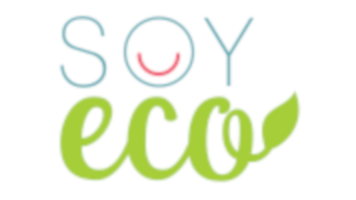

# Reto
¿Cómo podemos mejorar la recolección de residuos (plásticos, vidrio, cartón…)?

Solución:

# SoyEco

Aplicación mediante la cual se busca empoderar a los habitantes de Engativá para que cuiden el espacio en el que viven, tanto dentro de la casa como fuera, para así poder disfrutar todos de una ciudad más limpia y agradable.

# Integrantes

<ul>
  <li>Ana María Diaz</li>
  <li>Javier Morales</li>
  <li>Roselin Orozco</li>
</ul>

# Modelo de Base de Datos

